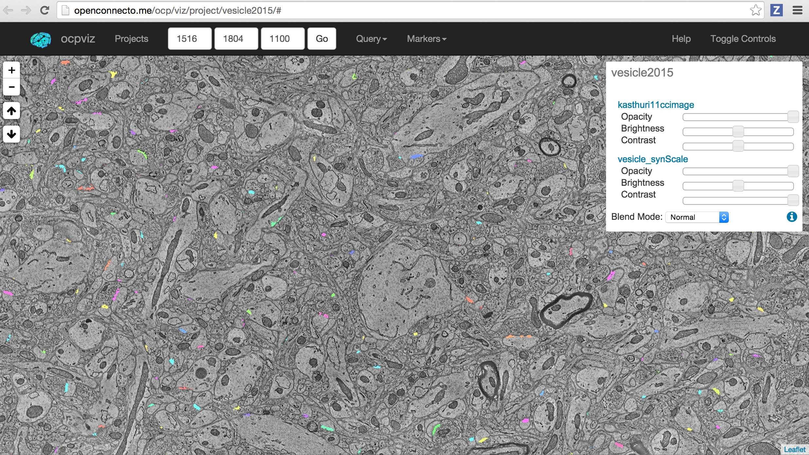
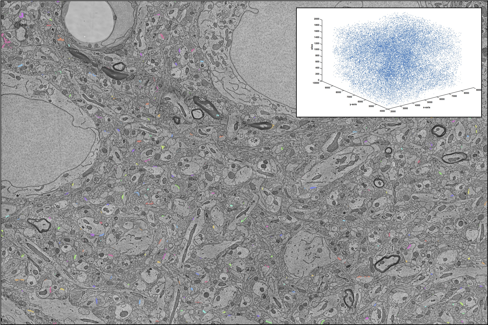

vesicle results
***************

Input Data
~~~~~~~~~~

We recommend training using AC4 and evaluating using AC3.  The provided vesiclerf code will download these volumes automatically.  More information about the available data, including computer vision membranes and vesicles can be found in the `datamap <https://github.com/openconnectome/nddocs/blob/gh-pages/datamap.md>`_.

View Results
~~~~~~~~~~~~~~~~

For the most interactive browsing experience, try using `OCPViz <http://openconnecto.me/ocp/viz/project/vesicle2015/>`_.
We recommend changing the coordinates and sliders as shown in the following picture as a starting point.

To easily view the results, you may wish to execute RESTful calls of the following form in your browser.
Click `here <http://openconnecto.me/ocp/overlay/0.6/openconnecto.me/kasthuri11cc/image/openconnecto.me/vesicle_synScale/annotation/xy/1/2300,8300/4300,8300/1100/>`_
to download Figure 5 from the paper.

Example Data
~~~~~~~~~~~~

Example data for vesicle is available using `CAJAL <http://openconnectome.github.io/CAJAL>`_.  Data can be accessed directly using the following links:

Raw Image Data for Test Region
-------------------------------
http://openconnecto.me/ocp/ca/kasthuri11cc/image/hdf5/1/5472,6496/8712,9736/1000,1100/

Raw output of vesiclerf probability cube:
-----------------------------------------
http://openconnecto.me/ocp/ca/vesiclerf_example/prob/hdf5/1/5472,6496/8712,9736/1000,1100/

Operating Point 1:  precision: 0.26, recall: 0.92
-------------------------------------------------
http://openconnecto.me/ocp/ca/vesiclerf_example/op_point1/hdf5/1/5472,6496/8712,9736/1000,1100/

Operating Point 2:  precision: 0.89, recall: 0.71 (max F1 point)
------------------------------------------------------------------
http://openconnecto.me/ocp/ca/vesiclerf_example/op_point2/hdf5/1/5472,6496/8712,9736/1000,1100/

Operating Point 3:  precision: 1.00, recall: 0.22
-------------------------------------------------
http://openconnecto.me/ocp/ca/vesiclerf_example/op_point3/hdf5/1/5472,6496/8712,9736/1000,1100/

Truth data
-------------
http://openconnecto.me/ocp/ca/ac3ac4/ac3_synapse_truth/hdf5/1/5472,6496/8712,9736/1000,1100/
