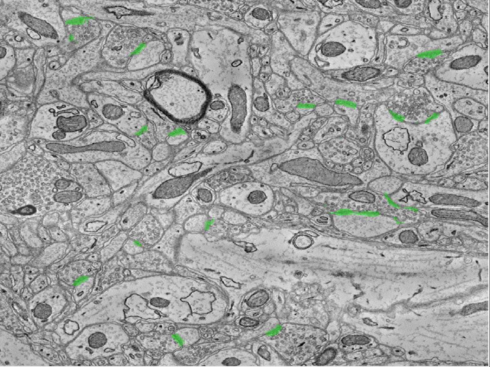
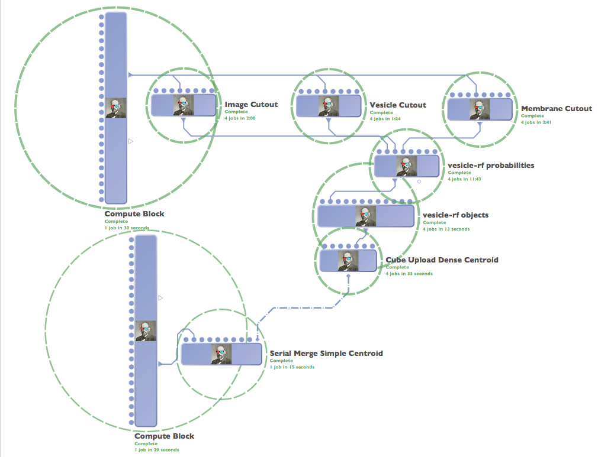

vesicle-rf
~~~~~~~~~~

To find synapses (i.e., graph edges), we develop a lightweight, scalable Random Forest-based synapse classifier. We combine texture (i.e., intensity measures, image gradient magnitude, local binary patterns, structure tensors) with biological context (i.e., membranes and vesicles). We pruned a large feature set to just ten features and used this information to train a random forest. The pixel-level probabilities produced by the classifier were grouped into objects using size and probability thresholds and a connected component analysis. This method requires substantially less RAM than previous methods, which enables large-scale processing. A key insight was identifying neurotransmitter-containing vesicles present near (chemical, mammalian) synapses.

These were located using a lightweight template correlation method and clustering. Performance was further enhanced by leveraging the high probability membrane voxels to restrict our search, improving both speed and precision. Our synapse performance was evaluated using the F1 object detection score, computed as the harmonic mean of the precision and recall, based on a gold-standard, neuroanatomist-derived dataset. We took care to define our object detection metric to disallow a single detection counting for multiple true synapses (as that result is ambiguous and allows for a single detection covering the whole volume to produce an F1 score of 1).

vesicle-rf is divided into three major sections:  training, evaluation, and deployment.

Validation (Quick Start)
------------------------

To get a sense of how the classifier works, we recommend first running the following function.  It leverages a pre-trained classifier and evaluates performance on a small test volume.

Performance metrics are imperfect (due to small volume issues), but you should achieve results similar to the following:

.. code-block:: bash

  metrics =

  precision: 0.8966
     recall: 0.6047
         TP: 26
         FP: 3
         FN: 17

.. code-block:: bash

  % function vesiclerf_example_short()
  % Driver function to demonstrate vesicle-rf functionality for new users.
  % This is an abbreviated version in the interest of time.
  %
  % **Inputs**
  %
  %	None.  Driver script is self-contained.
  %
  % **Outputs**
  %
  %	None.  Driver script is self-contained.
  %
  % **Notes**
  %
  % Using the default parameters, small edge synapses may be missed in this reference implementation.
  % As a prerequisite to running this script, you should have a trained classifier (provided in the git repo)
  % called bmvc_classifier - you can use a different classifier if desired

  if nargin < 2
      zStart = 1000;
      zStop = 1025;
  end

  zSlice = [zStart, zStop];
  padX = 50; padY = 50; padZ = 2;

  %Get data

  [eData, mData, sData, vData] = get_ac3_data(zSlice(1),zSlice(2), padX, padY, padZ);

  % Save Data in an appropriate format

  cube = eData.clone;
  save('eData.mat','cube');

  cube = mData.clone;
  save('mData.mat','cube');

  cube = sData.clone;
  save('sData.mat','cube');

  cube.setCutout(cube.data(1+padX:end-padX, 1+padY:end-padY, 1+padZ:end-padZ));
  save('sDataPR.mat','cube');

  cube = vData.clone;
  save('vData.mat','cube');

  % When deploying vesicle-rf, the core of the code consists of
  % vesiclerf_probs and vesiclerf_object
  %% PIXEL CLASSIFICATION
  vesiclerf_probs('edata', 'vData', 'mData', 'bmvc_classifier', padX, padY, padZ, 'classProbTest.mat')
  %% OBJECT PROCESSING
  vesiclerf_object('classProbTest.mat', 0.90, 0, 5000, 2000, 1, 0, 0, 'testObjVol.mat', 0, 0, 0)
  %% UPLOAD

  if 0 % sample upload - please provide your own token and channels
  server = 'openconnecto.me';
  token = 'vesicle_example';
  channel = 'prob';
  cubeUploadDense(server, token, channel, 'testObjVol', 'RAMONSynapse', 0)
  channel = 'object'
  end

  %% METRICS COMPUTATION
  pr_objects('testObjVol','sDataPR','metrics_short')
  metrics_short

  % visualize results
  load eData
  eData = cube;

  load testObjVol
  h = image(cube); h.associate(cube)

Preprocessing
-------------

Membrane detection is accomplished using caffe and is documented separately.  vesicle-rf assumes that membrane detection is completed for the region of interest prior to synapse detection.

Vesicle detection (here referring to neurotransmitter-containing vesicles) is accomplished using template matching (derived from the source dataset).

Vesicle identification may be run using the `vesicle_detect_quick.m` function, which is documented in Functions.

Training
--------

A training workflow exists to download manual annotations and data and build a classifier, using the `vesiclerf_train.m` function.  This function uses a combination of raw image data, manual truth labels, and computer vision results to train a classifier for downstream use.

Evaluation
----------

Once a classifier has been trained, a test volume can be evaluated using the functions:  `vesiclerf_probs` to compute pixel-level synapse probabilities, and `vesiclerf_object.m,` which post-processes the data to identify putative synaptic objects.  `pr_evaluate_full` is an evaluation function designed to grid search over the range of possible parameters to construct a precision-recall curve.

Deployment
----------

A deployment workflow - based on an operating point chosen in the evaluation step runs in LONI and includes functionality to merge across cuboid boundaries and compute centroids for each object.

Example Usage
-------------

We recommend learning to use our classifier by using the quick start above.  You may train and evaluate your own classifier by running two functions.  These take a total of about 2 hours to complete, due largely to the inefficient and large parameter space swept after classification.

Running the full string can be accomplished by executing:

.. code-block:: bash

  vesicle_rf_train('your_classifier')
  vesicle_rf_example() %change the script to reflect your classifier, if needed.
